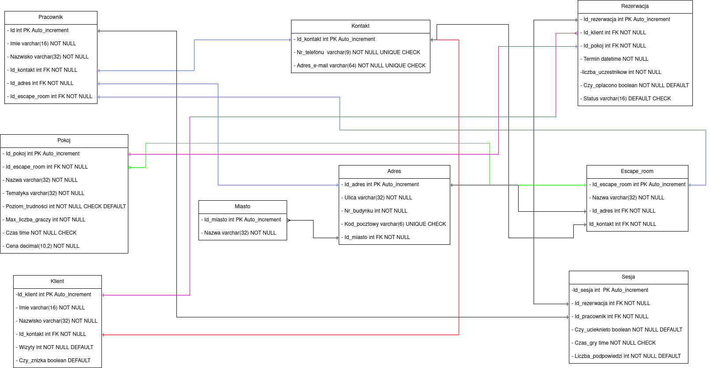

Problem klienta:
Pan Tomek ma 3 lokalizacje escape roomów w Warszawie, Gdańsku i Poznaniu. Każda
lokalizacja ma kilka pokoi o różnej tematyce.

Dlaczego jest w schemacie 3NF?
Spełnia warunek 1NF, czyli:
- ma klucz główny,
- pola zawierają pojedyncze wartości (nie ma list w jednej kolumnie),
- nie ma grup powtarzających się.
- Każda komórka przechowuje jedną wartość.

Spełnia warunek 2NF, czyli:
- brak zależności częściowych od klucza głównego, to znaczy, że każda kolumna niebędąca kluczem musi zależeć od całego klucza głównego

Spełnia warunek 1NF, czyli:
- rak zależności przechodnich, to oznacza, że kolumny niebędące kluczem nie mogą zależeć od innych kolumn niebędących kluczem
